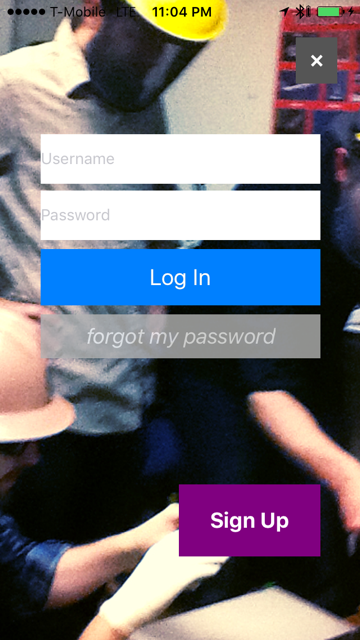

# SudoCare Login

Basic login flow for SudoCare iOS App

This is part of the larger SudoCare iOS Project. It's meant to be dropped into any project, forked and hacked.

A project to create tools so that people can learn about, maintain and give back to their beloved SudoRoom hackrrspace.

[https://sudoroom.org/wiki/SudoCare](https://sudoroom.org/wiki/SudoCare)

# Details

*  The entire project broken up into small modules npm style so check at the wiki to find the other pieces like the QR code component

* Initially starting out with the Facebook Parse BAAS, which is open sourced later this year. Later this iOS module will transition to an open source login run on a SudoRoom server. 

* I'm just doing this on Parse for now to show the proof of concept.

* Start with Obj-C but transition to Swift, which is going open source by the end of 2015

# Legos

## TPKeyboardAvoiding
* TPKeyboardAvoiding - this is an open source library [tasty pixel TPKeyboardAvoiding](http://atastypixel.com/blog/a-drop-in-universal-solution-for-moving-text-fields-out-of-the-way-of-the-keyboard) __if you don't do ios development you should know that anything involving textfields and keyboards is a major PTA__

## SecretKeys.h

Gitignore ignores the keys for this, check with Romy for the keys. These are temporarily on Parse
until we can get a proper open source hackerspace back end server running etc. 

